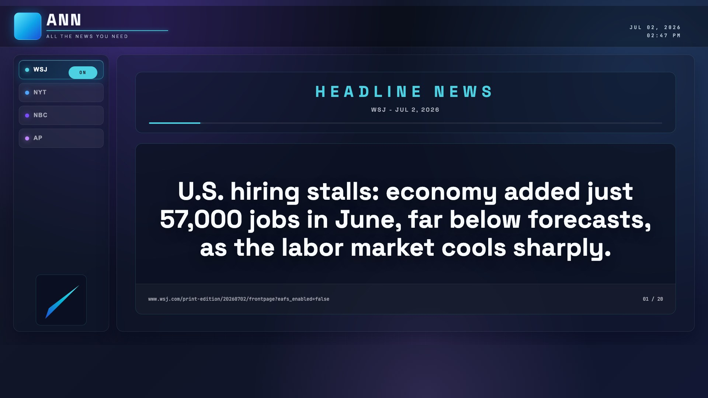
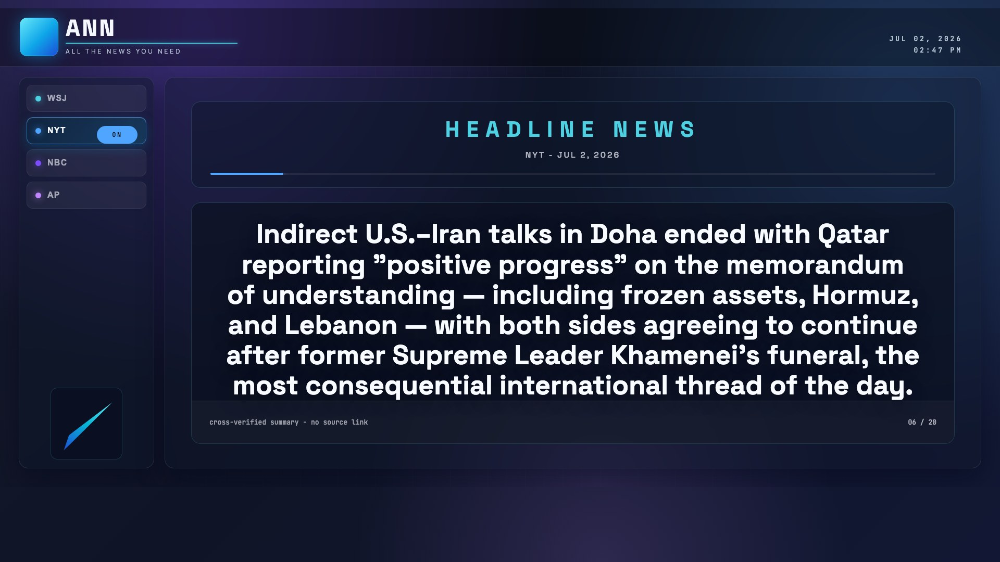
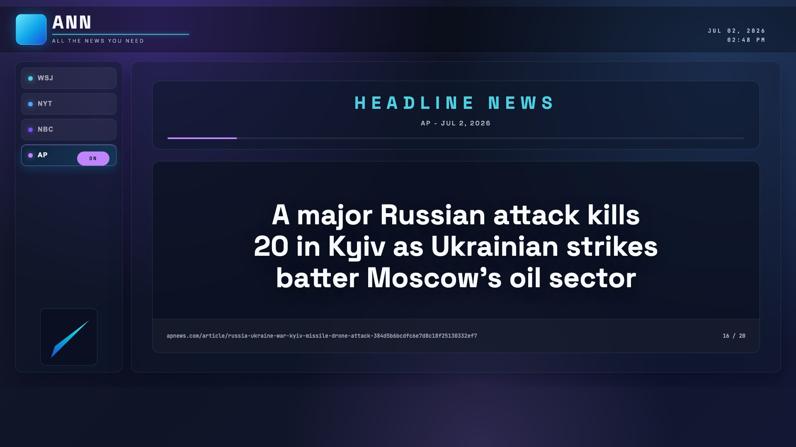

# ANN — All the News You Need

[](https://github.com/wbrown-dev/ann/actions/workflows/ci.yml)
[](LICENSE)
[](pyproject.toml)

[Go to Today's Headlines.](headlines-2026-07-02.md)

A tiny daily news digest for people who know they don't need the news but are
afraid of missing something truly important.

> The premise: news consumption is not civic virtue, a way to stay
> well-informed, or a sound path to better understanding the world. The news is
> inherently prone to focusing on outlier events, sensational content, and
> outrage. It's entertainment posing as information. You don't need to follow it.

ANN fetches candidate headlines from major outlets, asks the configured model
provider to keep only the five per outlet most likely to **still matter in 30
days** — significance, not virality — and writes a small Markdown digest. A
Streamlit dashboard then puts those headlines on a calm, rotating display.

## Screenshots



| NYT headline rotation | AP headline rotation |
| --- | --- |
|  |  |

## Attribution

The original concept, premise, and digest format are the work of
**[ulyssestenn](https://github.com/ulyssestenn/allthenewsyouneed)**. This
repository is an independent implementation of what that project describes, with
full credit and rights to the original idea reserved to its author. See
[`NOTICE`](NOTICE).

## What it does

Each run generates a file named `headlines-YYYY-MM-DD.md` containing five
headlines each from:

1. **WSJ** — material significance: markets, law, institutions, geopolitics.
2. **NYT** — agenda-setting influence among cultural and professional elites.
3. **NBC** — mainstream national news.
4. **AP** — the wire-service baseline.

Headlines are selected for durable consequence (war, courts, elections,
regulation, markets, science, public health, infrastructure) and deliberately
avoid celebrity news, outrage bait, polling noise, and viral filler.

**No fabrication:** the model chooses candidates *by index only*, so every
title and link comes verbatim from the source feed. Where a URL cannot be
confirmed, the digest carries a cross-verified summary with no link.

## Quick start

```bash
python3 -m venv .venv
.venv/bin/pip install -r requirements.txt
cp .env.example .env          # add your provider API key

.venv/bin/python ann.py run   # generate today's digest
.venv/bin/streamlit run streamlit_app.py   # open the dashboard on :8501
```

By default ANN uses Anthropic (`ANTHROPIC_API_KEY`). To use OpenAI or Google
Gemini instead, set the matching key (`OPENAI_API_KEY`, or `GEMINI_API_KEY`) and
run with `ANN_MODEL_PROVIDER=openai` / `ANN_MODEL_PROVIDER=gemini`, or pass
`--model-provider <provider> --model <model-name>`.

## The dashboard

The Streamlit app uses a TV-friendly dark ANN display: a four-outlet left rail,
live date/time, outlet-specific accent colors, and a large rotating headline
panel with high-contrast white text. It rotates through every headline in the
latest digest — 10 seconds each — and highlights the active outlet as each story
appears. The dashboard checks for updated digest files every 30 seconds.

## Run with Docker

```bash
export ANTHROPIC_API_KEY=sk-...
docker compose up --build     # http://localhost:8501
```

See [`docs/DEVOPS.md`](docs/DEVOPS.md) for image details and CI.

## Documentation

- [Architecture](docs/ARCHITECTURE.md) — pipeline, modules, the no-fabrication guarantee
- [Development](docs/DEVELOPMENT.md) — setup, tests, R&D notes
- [Continuity](docs/CONTINUITY.md) — current state, shipped sessions, invariants, open ideas
- [Dev-Ops](docs/DEVOPS.md) — CI/CD, Docker, releases
- [Contributing](CONTRIBUTING.md) · [Code of Conduct](CODE_OF_CONDUCT.md) · [Security](SECURITY.md) · [Changelog](CHANGELOG.md)

## Tests

```bash
.venv/bin/python -m pytest
.venv/bin/ruff check .
```

## What this is not

This is not an attempt to showcase balance, and not a substitute for being
informed — which requires reading and contemplating actual books and longform
content, not the news. This is (more than) all the news you need.

## License

[MIT](LICENSE) © 2026 William C. Brown and the ANN contributors. Original
concept © [ulyssestenn](https://github.com/ulyssestenn/allthenewsyouneed).
